# SharePoint Embedded for Visual Studio Code

The SharePoint Embedded Visual Studio Code extension helps developers create, configure, and manage SharePoint Embedded resources from Visual Studio Code, including container types that use trial, standard, or direct-to-customer billing.

> [!IMPORTANT]
> To start building with SharePoint Embedded you will need a Microsoft 365 tenant.
> If you do not already have a tenant, you can get your own tenant with the [Microsoft 365 Developer Program](https://developer.microsoft.com/microsoft-365/dev-program), [Microsoft Customer Digital Experience](https://cdx.transform.microsoft.com/), or create a free trial of an [Microsoft 365 E3 license](https://www.microsoft.com/microsoft-365/enterprise/microsoft365-plans-and-pricing).

## Install SharePoint Embedded for Visual Studio Code

1. Open a new window in [Visual Studio Code](https://code.visualstudio.com/) and navigate to "**Extensions**" on the activity bar.
1. Search "SharePoint Embedded" in the Extensions view. You can also view the extension in [Visual Studio Marketplace](https://marketplace.visualstudio.com/items?itemName=SharepointEmbedded.ms-sharepoint-embedded-vscode-extension).
1. Select **"Install"** and the SharePoint Embedded icon will appear on the activity bar.
1. Select the icon to open the SharePoint Embedded view and create a container type with the billing method you need.

### Sign in

To use the extension, you must sign into a Microsoft 365 tenant.

If you don't already have a tenant, you can get a tenant through the [Microsoft 365 Developer Program](https://developer.microsoft.com/microsoft-365/dev-program), [Microsoft Customer Digital Experience](https://cdx.transform.microsoft.com/), or create a free trial of an [Microsoft 365 E3 license](https://www.microsoft.com/en-us/microsoft-365/enterprise/microsoft365-plans-and-pricing).

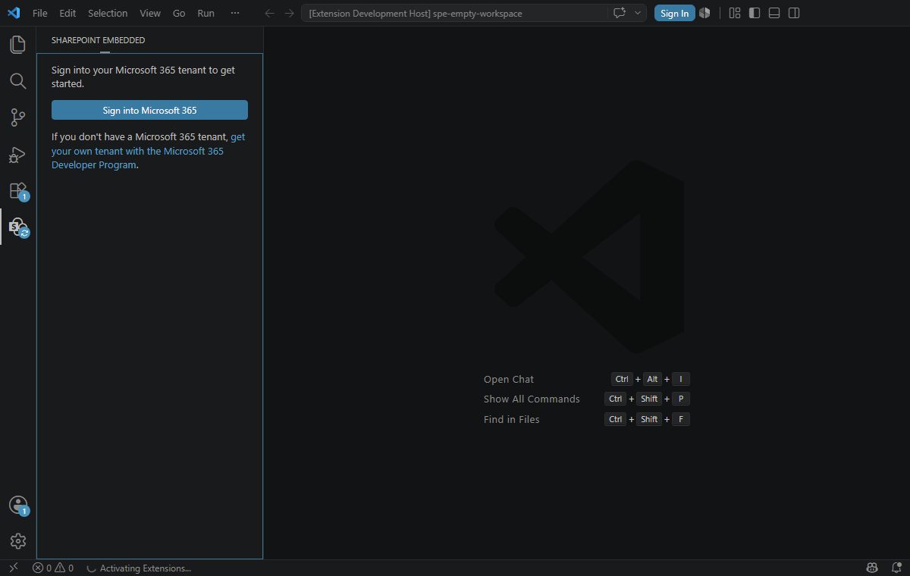

## Create a standard billed container type

Once signed in, you are prompted to create a [container type](https://learn.microsoft.com/en-us/sharepoint/dev/embedded/concepts/app-concepts/containertypes). A container type lets you start calling SharePoint Embedded APIs and building applications using SharePoint Embedded. For production and line-of-business development, create a **standard** billed container type so usage is billed to the organization that owns the app.

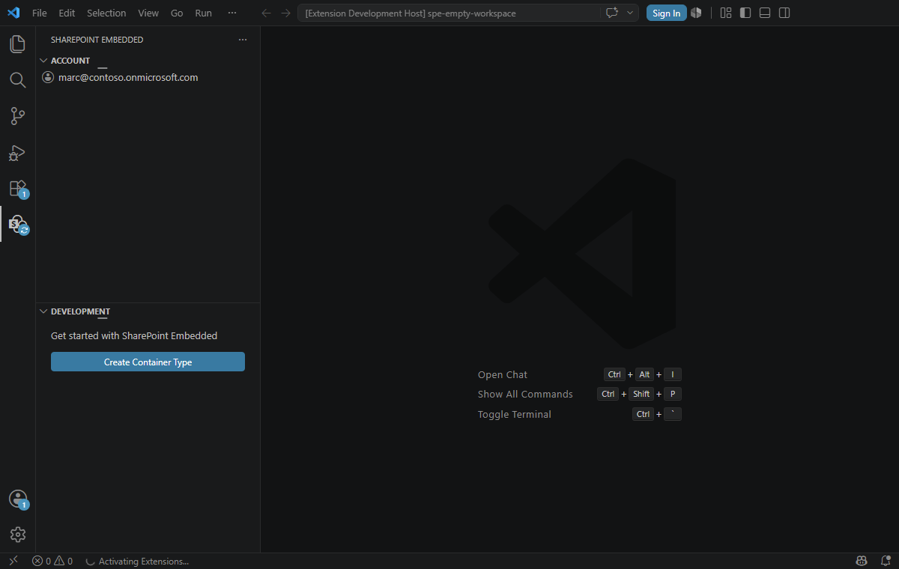

- Select **Create Container Type**
- Select **standard** as the billing method. The extension will attach Azure billing by using a subscription and resource group that your account can access.

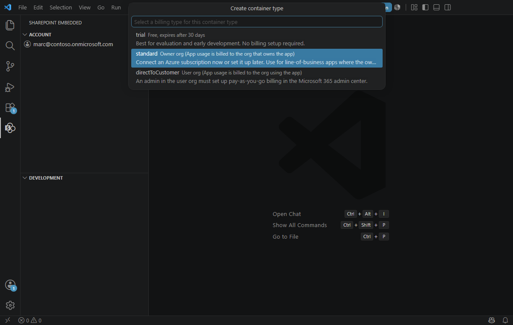

- Follow the prompts to name your container type. You can change your container type name later on.

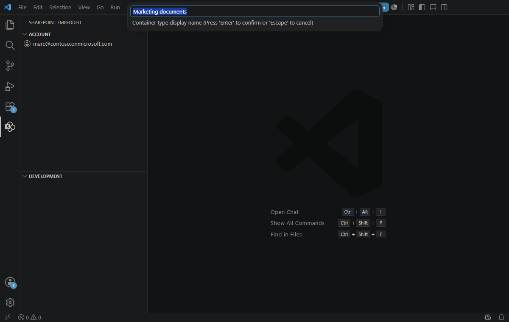

## Create a Microsoft Entra ID App

Every container type is owned by a Microsoft Entra ID application. When creating a container type, you can create a new Microsoft Entra ID application or pick one of your existing applications as the owning application. Learn more about SharePoint Embedded [app architecture](https://learn.microsoft.com/en-us/sharepoint/dev/embedded/concepts/app-concepts/app-architecture).

- Follow the prompts to name your new Entra application or select an existing application ID

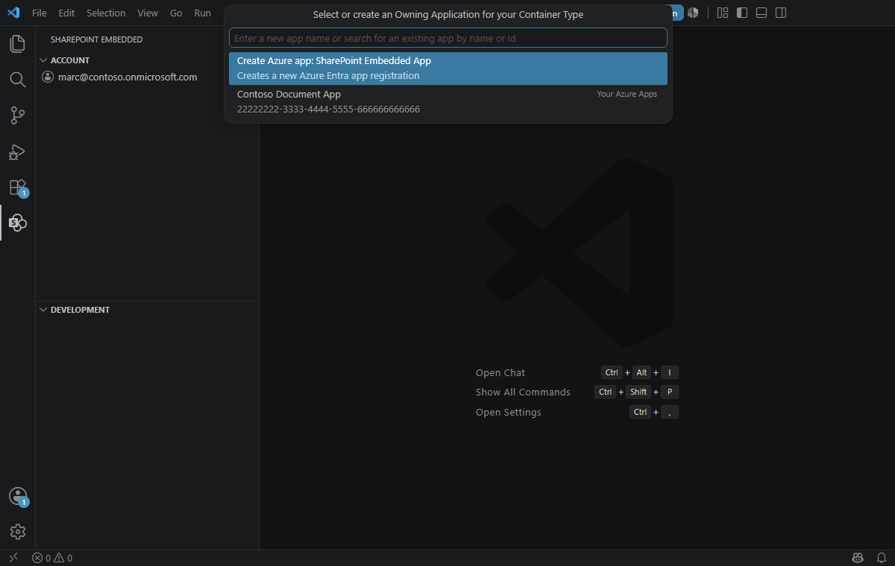

> [!NOTE]
> If you choose an existing application, the extension will update that app's configuration settings for it to work with both SharePoint Embedded and this extension. Doing this is NOT recommended on production applications.

After your container type is created and your application is configured, you'll be able to view your Local tenant registration as a tree in the left nav-bar.

## Configure standard billing

Standard container types require an Azure billing account. After the container type is created, the extension walks you through the Azure setup:

- Pick an Azure subscription that your account can access. You need Owner or Contributor permissions on the subscription.
- Pick a resource group where the Microsoft Syntex billing account will be created.
- The extension registers the **Microsoft.Syntex** provider and provisions the billing account for the container type.

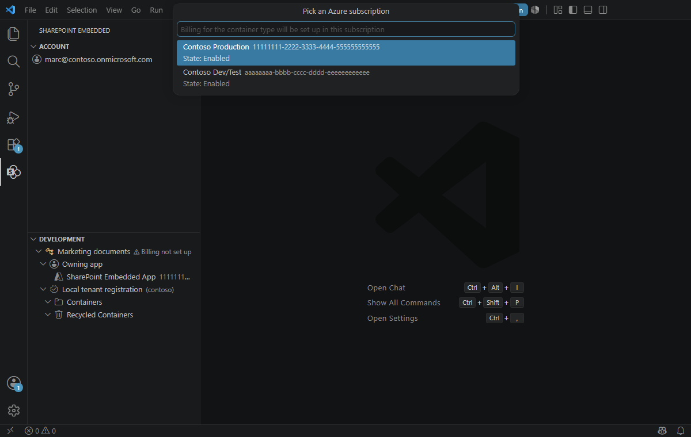

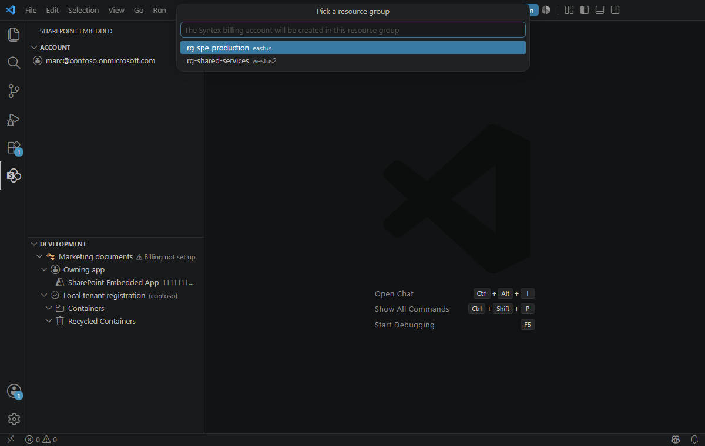

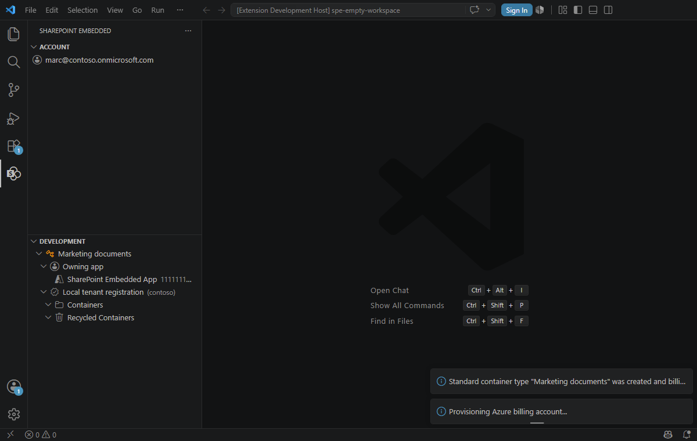

If you skip billing setup or do not have the required Azure permissions, the container type remains visible in the tree with **Billing not set up**. Right-click the container type and select **Attach billing** when you are ready to finish setup.

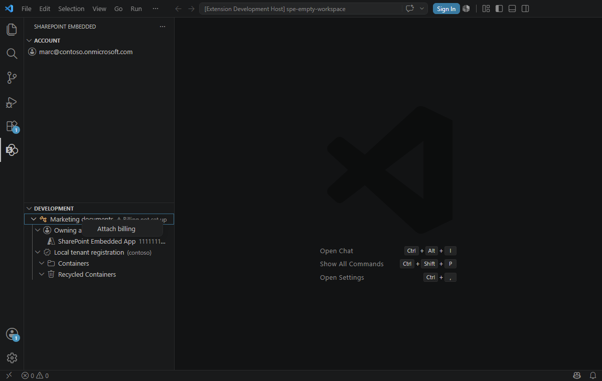

## Other billing methods

The extension also supports **trial** container types for evaluation and **directToCustomer** container types for user-org billing. Trial container types do not require billing setup and expire after 30 days. Direct-to-customer container types do not use the Azure subscription flow in the owning organization; billing is configured by a Global Administrator in the consuming tenant. The extension prompts you to open the Microsoft 365 admin center pay-as-you-go billing setup.

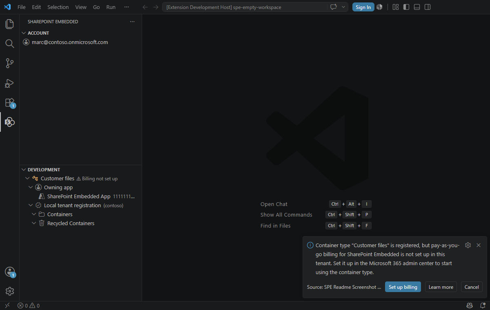

## Register your container type

After creating your container type, you'll need to register that container type on your local tenant. Learn more about container type [registration](https://learn.microsoft.com/en-us/sharepoint/dev/embedded/concepts/app-concepts/register-api-documentation).

- Follow the prompts and select **'Register on local tenant'** on the lower right corner of the VS Code window
- If you don't see the prompt, you can right-click on your `<container-type-name>` and select **Register** from the menu

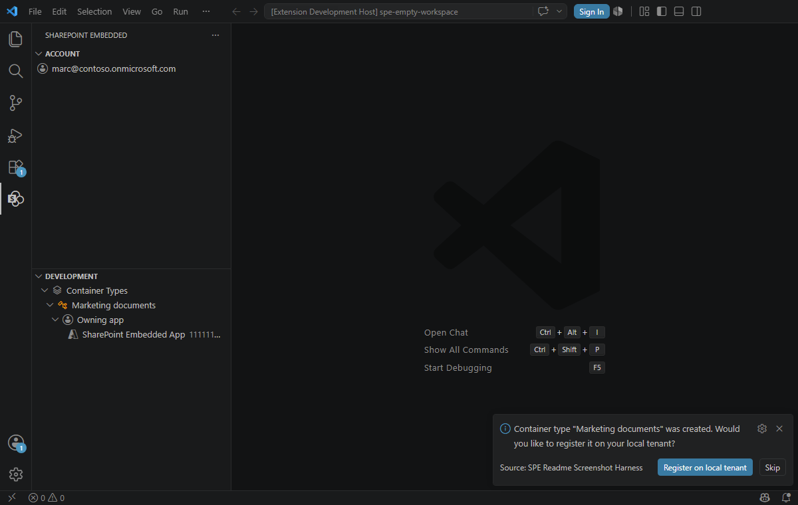

## Create your first container

With your container type registered, you can now create your first container. Only five containers of container type can be created to upload and manage content.

- Right-click on the **Containers** drop-down from the tree in the left nav-bar and select **Create container**
- Enter a name for the container you would like to create

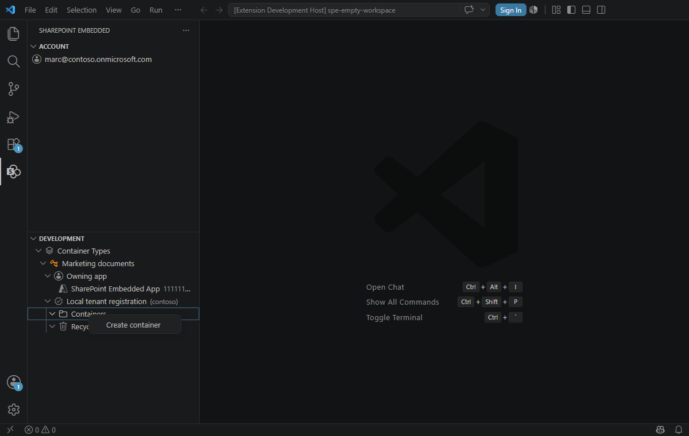
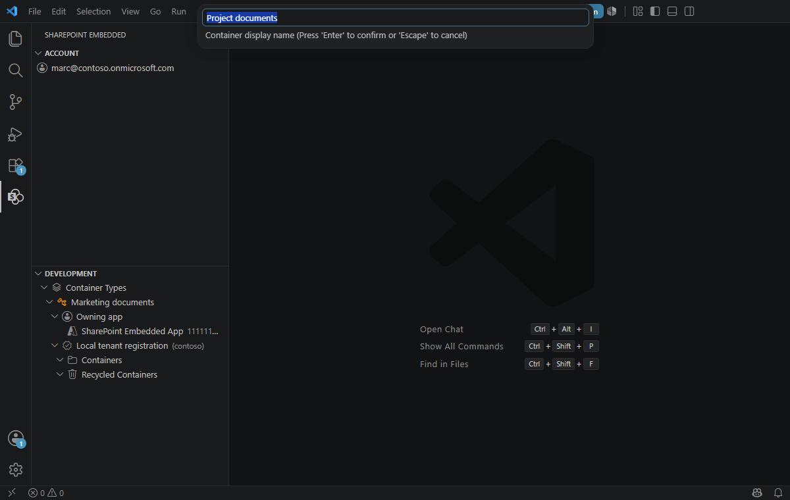

## Recycling Containers

You can also recycle and recover containers within the extension.

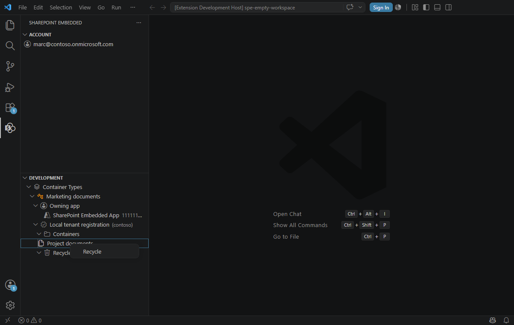

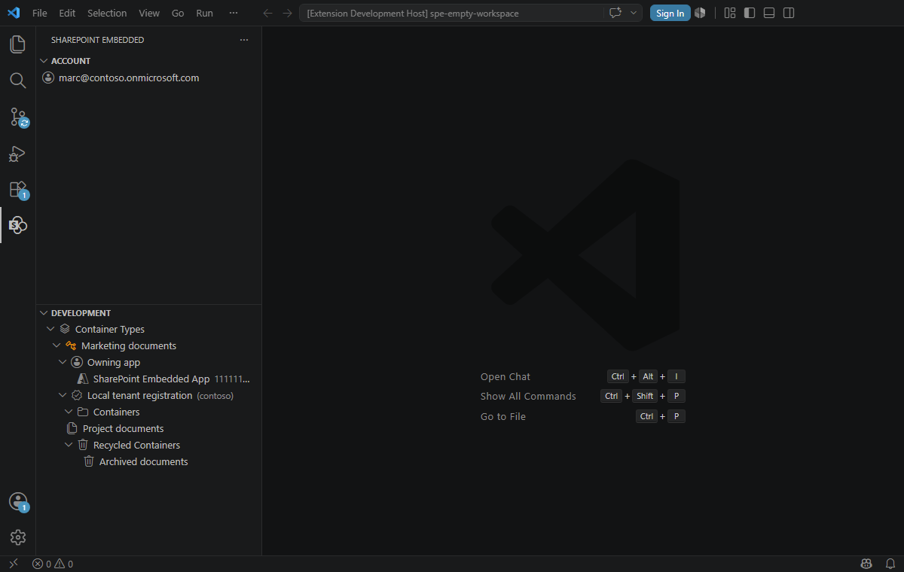

## Load Sample App

With your container type created and billing configured, you can use the extension to load one of the SharePoint Embedded sample apps and automatically populate the runtime configuration file with the details of your Microsoft Entra ID app and container type.

## Export Postman Environment

The [SharePoint Embedded Postman Collection](https://github.com/microsoft/SharePoint-Embedded-Samples/tree/main/Postman) allows you to explore and call the SharePoint Embedded APIs. The Collection requires an environment file with variables used for authentication and various identifiers. This extension automates the generation of this populated environment file so you can import it into Postman and immediately call the SharePoint Embedded APIs.

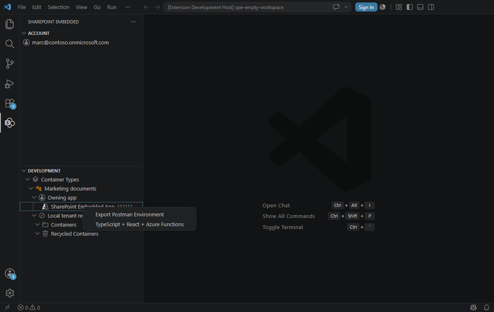
